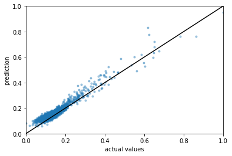

# PlantTech report
__Carlos Leon__

## Elevator Pitch

This project aims to show the process of two things: the construction of a machine learning model to explain a client dataset, and the reduction the number of features the client will need to take care of.

## Dataset insights
The file `assignment.csv` contains collected information of 24 features named as `par_0`, `par_1`, ..., and the target `y`. Missing values and normalization procedures can be applied through a pipeline. 

<b>Figure 1. </b> Scatter plot of the first 3 features and the target.  Strong colors shows a higher density distribution. Diagonal plots display histograms

Fig.1 exhibits some correlation between `par_0` and `y`, but poor correlation between `par_` features (a scatter plot between all the targets is attached, see `scatter.png`). Therefore, features can be approximated as independent parameters. A more detailed answer on the correlation between features and target is shown in Table 1.

|            | correlation  |
|-----------:|:-------------|
|  `y`       | 1.00         |
|  `par_4`   | 0.32         |
|  `par_12`  | 0.21         |
|  `par_8`   | 0.12         |
|  `par_16`  | 0.10         |
|  `par_0`   | 0.07         |
|  `par_20`  | 0.06         |
|  `par_11`  | 0.03         |

<b>Table 1</b>. Absolute values of the correlation between target and parameters

From Table 1, `par_4, 12, 8, 16` and `0` are the five features that contribute the most to the target. The entire correlation matrix is shown in the file `runMe.ipynb` and it shows the feature independence mentioned before (very low values of correlation between parameters).

## Machine learning models
### Fine-tune model
After setting aside a validation set (splitting of 20%), linear regressions and random forest regressions has been applied to the entire training set with 24 features, and also to a subset containing only the best 5 features. 

__RMSE values__
|                   | 24 features  | 5 best features |
|------------------:|:-------------|:----------------|
|  linear terms     | 0.046       | 0.047            |
|  polynomial terms | --          | 0.015            |
|  random forest    | 0.007       | 0.006            |

<b>Table 2</b>. RMSE values for the chosen ML models. Linear regressor models were tested with manipulated input containing only linear terms or 5th-degree polynomial terms.

To obtain the RMSE values shown in Table 2, models were tested for a small subset of the training set (a more complex procedure would involve cross-validation). This process allows us to choose the best model for which the validation test will be employed: random forest (expensive: 2 min) and/or linear regressor for 5th-degree polynomials (cheap: seconds). Default scikit-learn parameters were used for the random forest regressors. Here, a grid search cross-validation was also performed, but without significant improvement on the RMSE value.

### Validation

Finally, the chosen models were applied to predict the targets on the validation test. Table 3 shows no significant different in the RMSE value between the two models. However, the linear regressor using polynomial terms was computationally cheaper. 

Fig. 2 shows the relationship between predicted and target values. An ideal model would locate this relationship over the identity function (black line).

__RMSE values__
|                   | 5 best features |
|------------------:|------------|
|  polynomial terms | 0.0286     |
|  random forest    | 0.0295     |

<b>Table 3</b>. Linear regressor with polinomial terms vs random forest RMSE values for the validation test

<b>Figure 2</b>. Prediction vs target relationship for the validation test

## Conclusions
A linear regressor model and a 5th-degree polynomial combinations for the 5 best features can deliver the same RMSE values than other complex models studied here, and is able to employ less computational resources. The client may focus on the following features: `par_4`, `par_12`, `par_8`, `par_16`, `par_0`.
